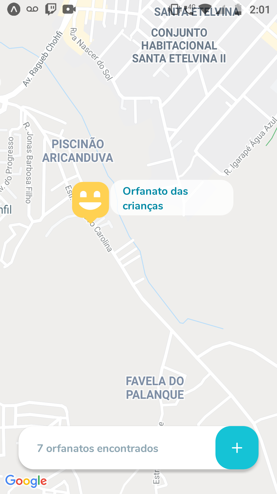
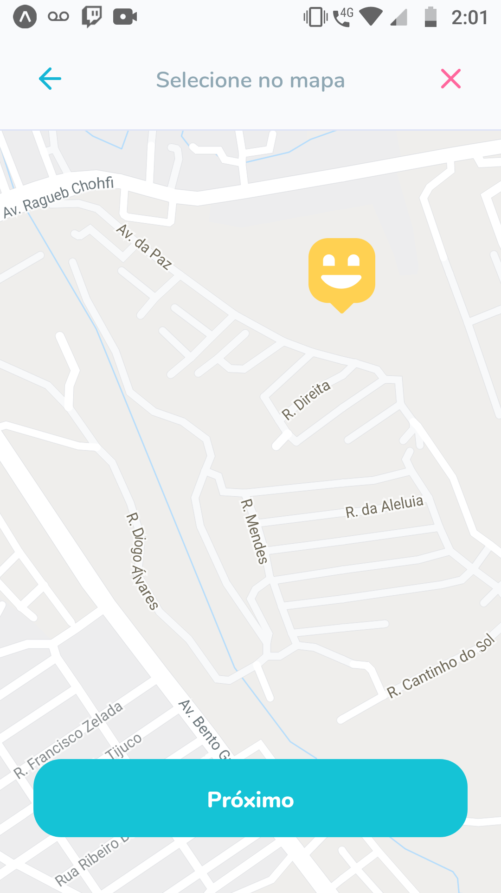
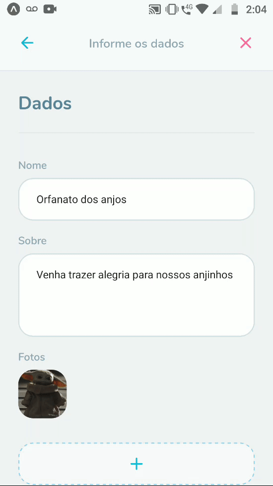

# Aplicação web
<div style='align: center'>


</div>
<br>
<br>

# Aplicação mobile (Android/IOS)





## Instalação

É preciso ter a versão LTS do <a href='https://nodejs.org/en/'>Node.js</a> instalada e um ambiente de desenvolvimento para <a href='https://reactnative.dev/docs/environment-setup'>React Native</a>.

Após isso basta rodar o comando no terminal:

```
npm install
```
ou
```
yarn install
```

### 🚀 Tecnologias utilizadas:
- TypeScript;
- Node.js
- ReactJS;
- React Native;
- Expo;
- SQLite;